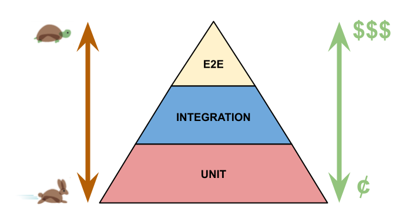

# FrontEnd TDD

## Software Test 란?

 > 제품 or 서비스의 품질을 확인   
 > 소프트웨어의 버그를 찾음   
 > **제품이 예상하는대로 동작하는지 확인** 

- 함수, 특정 기능, UI, 성능, API 스펙 등 원하는 기대사항을 테스트 코드를 작성하여 확인합니다.   
- 어떤 테스트를 목표로 하는지에 따라 사용할 수 있는 라이브러리나 프레임워크가 다양하다   

## 언제 테스트를 해야하는가?

- 일반 적인 테스트 과정   
Dev -> QA -> Publish (QA 과정이 비효율적이고 시간이 오래 걸리는 문제)
- 최신 테스트 환경   
개발을 하면서 테스트를 자동화하는 방식으로 발전

## 테스트를 작성하는 이유? 장점?
- 제품 / 기능이 원하는 대로 동작한다는 확신을 가질 수 있음
- 요구 사항에 대한 이해도가 높아짐
- 이슈에 대한 예측 가능
- 버그를 빠르게 발견 가능
- 리팩토링이 가능, 코드품질 향상
- 손쉬운 유지 보수
- 문서화에 용이
- 개발 시간을 절약

## 테스트 피라미드란?
- 어떤 서비스 / 플랫폼이냐에 따라 테스트 성격이 나뉨 단, 개발자라면 공통으로 작성해야하는 테스트가 존재 -> 테스트 피라미드   
   

 - `Unit Test`(단위 테스트) : 독립적인 단위의 함수, 모듈, 클래스 등을 테스트하는 것
 - `Integration Test`(통합 테스트) : 여러개의 단위 들을 묶어서 상호작용을 테스트(모듈들, 클래스들 등등)
 - `E2E Test`(end-to-end) : UI테스트, 사용자 테스트라고 부름 사용자가 실제로 프로그램을 사용했을 때의 flow를 테스트 하는 것
 > 비용적인 측면과 적용 속도면에서 피라미드 구조를 가짐
 > 이 외에도 다양한 테스트 종류 존재함

## TDD(Test-driven developement, 테스트 주도 개발) 란?
> 개발(코드 작성)전에 테스트 콛드를 먼저 작성하는 방법
- TDD flow
  1. 테스트 코드를 먼저 작성 함
  2. 작성한 테스트 코드를 실행 하고 실패
  3. 실패한 테스트 코드가 통과 될 만큼의 코드를 작성
  4. 다시 테스트 코드를 작성 반복
  5. 모든 과정의 테스트 완료 된다면 리팩토링    

- TDD 장점?
  - 요구 사항에 대한 분석 및 이해가 요구 됨
  - 설계 단계에서 리소스가 많이 투여 됨 
  - 사용자 입장에서의 코드 작성 (단순 구현 목표 x , 인터페이스 위주의 코드 작성 -> 코드 퀄리티 향상)

### TDD 언제 적용? 
- 무조건 `TDD` 방식 적용 x
- 다만, 배포전 혹은 main repository에 merge 하기 전에는 test code를 포함하는 것을 권장
- 문서화에 시에도 test code가 포함되어 있는 것이 효율적
- 요구사할이 명확할 때, 협업시 명세서(문서) 역할을 하기도함
> 정리 : 배포 하기 전, 코드를 메인 브랜치에 머지 하기전,  내 코드에 해당하는 내가 수정한 코드를 커버하는 테스트 코드가 있어야 할것!

## CI / CD에서의 테스트
 - 테스트 코드가 작성되어 있다는 가정하에 CI / CD 가 효율적

 ### CI / CD 간단 정리
  - 정의 : 어플리케이션 개발 단계 부터 배포까지 자동화를 통해 효율적으로 빠르게 배포하는것
  * `CI`(Continuous Integration, 지속적인 통합)
    - 변경, 개발 사항이 main repository에 주기적으로 빌드되고 테스트 되어서 merge 되는 것
    - 코드 변경사항을 주기적으로 빈번하게 머지해야함
    - 통합을 위한 단계(빌드, 테스트 ,머지)의 자동화
  
  * `CD`(Continuous Delivery or Continuous Deployment, 지속적 제공 or 지속적 배포)
    - 배포 단계에서 자동화할 수 있을지 고민하는 단계
    - CI 과정을 통해 빌드 후 테스트까지 마침 -> 개발자가 한번더 검증 후 수동 배포 -> Continuous Delivery
    - 최종 배포 까지 자동화 -> Continuous Deployment